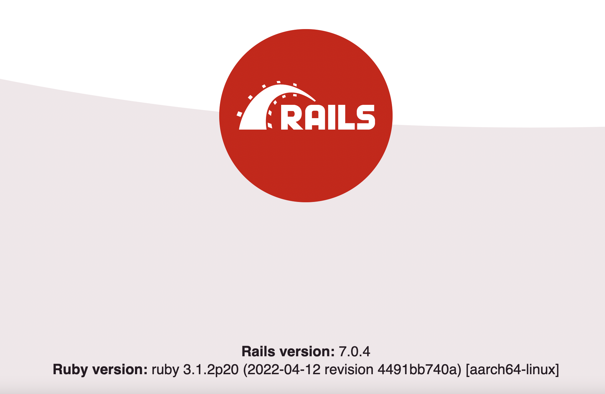

# Compose sample application

## Use with Docker Development Environments

You can open this sample in the Dev Environments feature of Docker Desktop version 4.12 or later.

[Open in Docker Dev Environments ](https://open.docker.com/dashboard/dev-envs?url=https://github.com/docker/awesome-compose/tree/master/rails-postgres)

### Rails application with PostgreSQL database

Project structure:

```text
.
├── app
│   ├── Dockerfile
│   ...
├── db
│   └── password.txt
├── compose.yaml
└── README.md
```

[_compose.yaml_](compose.yaml)

The compose file defines an application with two services `app` and `database`.
When deploying the application, docker compose maps port 3000 of the rails service container to port 3000 of the host as specified in the file.
Make sure port 3000 on the host is not already being in use.

## Deploy with docker compose

```shell
# docker compose up
[+] Building 20.3s (12/12) FINISHED
 => [internal] load build definition from Dockerfile
 => => transferring dockerfile: 368B
 => [internal] load .dockerignore
 => => transferring context: 2B
 => [internal] load metadata for docker.io/library/ruby:3.1
 => [1/7] FROM docker.io/library/ruby:3.1@sha256:5d4f7a70606b7da79a526369a4bd94d2518be1996faada98d0a220b5cbc7654f
...
rails-postgres-app-1       | => Booting Puma
rails-postgres-app-1       | => Rails 7.0.4 application starting in development
rails-postgres-app-1       | => Run `bin/rails server --help` for more startup options
rails-postgres-app-1       | Puma starting in single mode...
rails-postgres-app-1       | * Puma version: 5.6.5 (ruby 3.1.2-p20) ("Birdie's Version")
rails-postgres-app-1       | *  Min threads: 5
rails-postgres-app-1       | *  Max threads: 5
rails-postgres-app-1       | *  Environment: development
rails-postgres-app-1       | *          PID: 1
rails-postgres-app-1       | * Listening on http://0.0.0.0:3000
rails-postgres-app-1       | Use Ctrl-C to stop
```

## Expected result

Listing containers must show containers running and the port mapping as below:
```
$ docker ps
CONTAINER ID   IMAGE                                      COMMAND                  CREATED         STATUS         PORTS                    NAMES
26797f879fef   rails-postgres-app                         "bash -c 'bundle exe…"   2 minutes ago   Up 2 minutes   0.0.0.0:3000->3000/tcp   rails-postgres-app-1
d7d4e64e16f4   postgres:14                                "docker-entrypoint.s…"   2 minutes ago   Up 2 minutes   5432/tcp                 rails-postgres-database-1
9d2b81032013   docker/dev-environments-default:stable-1   "sleep infinity"         3 minutes ago   Up 3 minutes                            clever_mclaren
```

After the application starts, navigate to `http://localhost:3000` in your web browser.



Stop and remove the containers
```shell
$ docker compose down
[+] Running 3/3
 ⠿ Container rails-postgres-app-1       Removed
 ⠿ Container rails-postgres-database-1  Removed
 ⠿ Network rails-postgres_default       Removed
```
